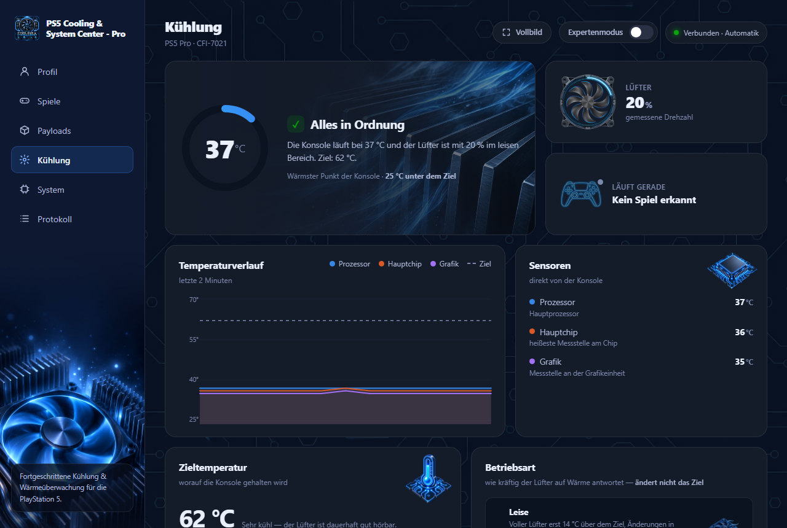
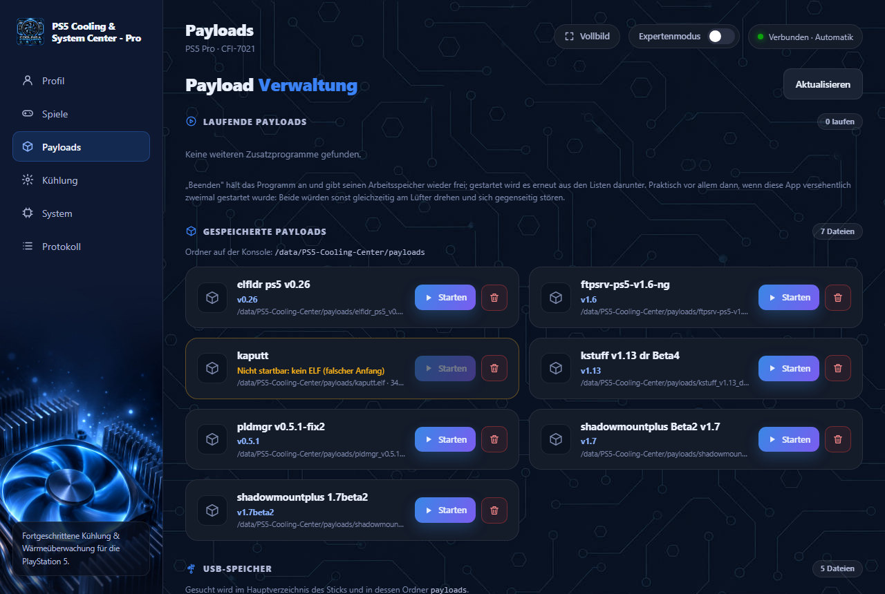
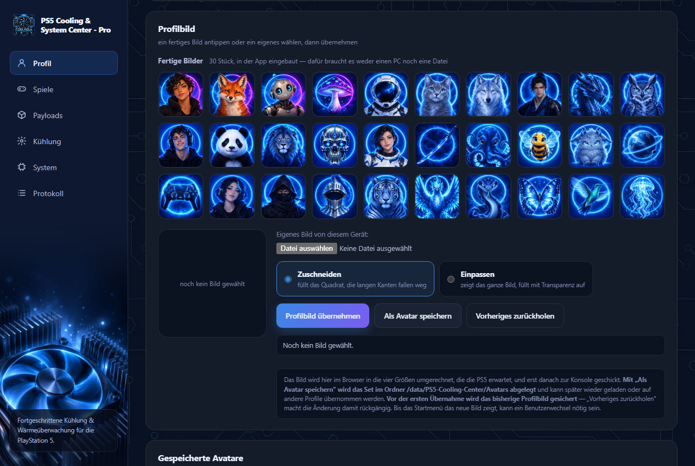
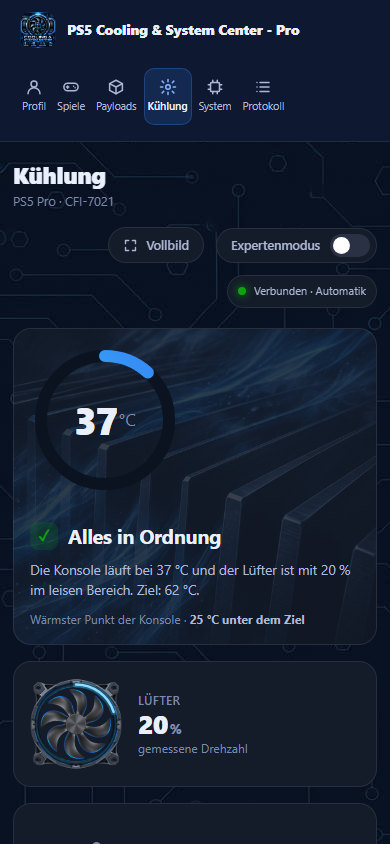

<div align="center">


# PS5 Cooling & System Center - Pro

**Fan control, temperature monitoring and system hub for the jailbroken PlayStation 5, with a web interface on your home network in six languages.**


[Features](#features) · [Installation](#installation) · [Usage](#usage) · [Documentation](#documentation) · [Legal](#legal-notice-and-disclaimer) · [Credits](#credits-and-acknowledgements)

[Deutsch](README.md) · **English** · [Italiano](README.it.md) · [Español](README.es.md) · [Français](README.fr.md) · [Русский](README.ru.md)

</div>

---

PS5 Cooling & System Center - Pro is a homebrew payload (ELF) for a jailbroken PlayStation 5. It reads the console's temperature sensors, controls the fan according to a calm, freely adjustable comfort curve and comes with a web interface that you open from any device on your home network: phone, tablet or PC. On top of that come game management, payload management and the console's profile management. Everything runs on the PS5 itself, without a PC and without internet.

The project is the successor to *PS5 Temperature Manager*; the back end (C) and the interface have been rewritten from scratch.

<p align="center">
  
</p>

<table>
  <tr>
    <td width="50%"></td>
    <td width="50%"></td>
  </tr>
  <tr>
    <td align="center"><sub>Start, copy and quit payloads (sample data)</sub></td>
    <td align="center"><sub>Choose a profile picture from 30 built-in pictures</sub></td>
  </tr>
</table>

<details>
<summary>Works on a phone, too</summary>
<p align="center"></p>
</details>

## Features

**Cooling**

- **Comfort control of the fan.** Holds a target temperature (default 66 °C, adjustable from 60 to 91 °C; 91 °C is the console's own value) with a moving average, a dead zone and the trend, and only changes the fan speed in small steps. The goal is not the lowest temperature but a fan that sounds calm and even. Operating modes (Quiet, Balanced, Cool), quick select and custom rules per game.
- **Safety first.** From the safety temperature (default 78 °C) on, only the hardware counts. If the app is not running, the console controls the fan with its own curve.
- **Readings.** Processor, main chip, graphics (PS5 Pro only), fan speed, load of all CPU cores, live clock, power draw of the voltage rails, in-game frame rate and controller battery. History over 2 minutes and 24 hours, and a weekly evaluation of the cooling performance.
- **Notifications on the TV.** At start, on warnings and, if you like, at regular intervals. Two short presses of the controller's mute button show the processor temperature and the fan.

**Management**

- **Games.** The games on the Home screen with cover, play time, format and location. Start them directly (if another game is running, a note points this out; “Close game” closes it immediately, then the next one starts with a tap), copy them to other drives, move or extract them with ShadowMountPlus and convert them into exFAT, ffpkg and ffpfsc images without a PC. A second tab records play time: when you played, for how long and how warm the console got, with totals, daily bars and a ranking. A third backs up saved data to a stick, a disk or console storage and restores a title on request: unchanged and encrypted, every file read back and verified, and before restoring, the current state is backed up separately. Copies and images are read back completely after writing and verified; next to them is a `.sha256` file that can be checked again later on a PC with `sha256sum -c`. A switch “Save covers & metadata” stores the cover images and the game details that are slow to determine on the console (folder `covers_and_more`) so that the list loads faster. A fourth tab, “Packages”, finds the game packages (`.pkg`) on sticks, disks and in console storage, shows them with picture, version and type, splits large packages into parts for FAT32 sticks or discs (read back and verified; the package stays unchanged) and, on request, installs a package through the console's own installation: the app only provides it, checks beforehand what would get in the way, shows the progress and deletes or overwrites nothing.
- **Files.** A file manager for the console's folders: view, download, upload, create a new folder, rename, copy, move and delete (changes only on the drives and in `/data`; deleting asks twice). The list can be sorted by name, size or date, all entries can be selected at once, a folder's size is counted on request, and “View” shows pictures and text files right in the browser.
- **Payloads.** View and quit running payloads. Start your own `.elf` files from a folder on the console or from a USB stick, or copy them into the folder, entirely without a PC.
- **Profile.** Change the display name; profile picture from 30 built-in pictures or from your own file, with a backup of the previous picture.
- **System.** Model, firmware, uptime, storage and network. Raw sensors and diagnostics in expert mode. Event log for exporting.
- **Header.** On every page: Rest Mode, Restart, Turn off and Safe Mode (each after two clicks, as a group in the middle), Fullscreen and Expert mode.
- **Languages.** The interface is available in German, English, Italian, Spanish, French and Russian; you choose the language at the top right (on the first visit, the browser's language applies). The manual and the FAQ are in the app in all six languages and available as PDF downloads. Notifications that the console itself shows on the TV are in German.
- **Home screen tile.** Opens the interface directly in the console's browser.

**Technology.** Its own HTTP server without a third-party library (the interface files are sent compressed over the network), a documented [JSON interface](docs/API.md), settings in `/data/PS5-Cooling-Center/config.json`, no internet access (the app only connects to programs on the console itself).

## Requirements

| | |
| --- | --- |
| **Console** | PS5 with a jailbreak and an ELF loader on **port 9021** ([elfldr](https://github.com/ps5-payload-dev/elfldr) or equivalent). Tested on a **PS5 Pro (CFI-7021) with firmware 12.00**. Other models and firmware versions are untested. The graphics temperature is only available on the Pro. |
| **Firmware** | The ELF is built with the PS5 payload SDK **v0.43**, whose start-up code knows firmware **up to 13.60**. On a firmware that the start-up code does not know, the program never reaches `main()`: it then does not start at all and writes nothing to the log. That it starts on 13.xx does not yet mean that fan control and sensors work there as they do on 12.00: this has **not been checked**. |
| **kstuff** | Needed for fan control (`/dev/icc_fan`). Without kstuff, sensors and interface keep working; the control reports “not available”. |
| **Network** | A browser on the same network as the console. |
| **optional** | [ShadowMountPlus](https://github.com/drakmor/ShadowMountPlus) for moving and extracting games and for detecting format and location. |

## Installation

1. Download the file `PS5_Cooling_System_Center_v<Version>.elf` from the **Releases**.
2. Send the ELF to the console, port **9021**, with any payload sender or from the command line:

   ```bash
   nc -q0 <PS5-IP> 9021 < PS5_Cooling_System_Center_v1.50.0.elf
   ```

3. A notification with the address appears on the TV. Open it in the browser: **`http://<PS5-IP>:8086`**
4. The program creates the Home screen tile (“Media” section) itself on the first start; no installer is needed. The tile survives restarts but does not start the program; it only opens the interface. If it goes missing later, “Install tile” on the System page brings it back; as a fallback, `cooling-center-launcher-installer_v<Version>.elf` is included.

After every restart of the console, the ELF has to be sent again, for example via an autoloader. Only **one** instance may ever run: two instances would control the fan against each other. An old instance can be stopped on the “Payloads” page. The detailed guide comes with the release as [LIESMICH](docs/LIESMICH.txt).

## Usage

| Page | Contents |
| --- | --- |
| **Profile** | Display name and profile picture of the console |
| **Games** | Start, copy, move and convert games; play time with temperatures; back up and restore saved data |
| **Files** | File manager: view folders, upload and download files, copy, move, delete |
| **Payloads** | Running, saved and USB payloads |
| **Cooling** | Status, history, sensors, target temperature, operating mode, game profiles |
| **System** | Console, storage, network, diagnostics, turning off and restarting |
| **Log** | App events, exportable as `.log`, and the console's live kernel log with filter, pause, saving on the console and recording |
| **Credits** | Thanks to the developers whose work is in the app; plus **Manual** and **FAQ** in your language |

Everything else is in the [manual](docs/HANDBUCH.md): comfort control and its parameters, starting payloads, profile pictures, the tile, the on-screen display and the settings.

**Access on the home network.** The interface has no login: every device on the home network can read and change things. The console does not belong on the open internet, so **do not set up port forwarding** to port 8086. If you don't want that, set `bind_address` to `127.0.0.1`. The server rejects requests that recognisably come from outside websites. Details are in the [manual](docs/HANDBUCH.md#zugriff-und-sicherheit-im-heimnetz) and in the [security policy](SECURITY.md).

## Building from source

You need the [PS5 payload SDK](https://github.com/ps5-payload-dev/sdk) **v0.42 or later** (built and tested with **v0.43**): its start-up code decides on which firmware the ELF starts at all, and v0.41 ends at 13.40. The build checks this (`tools/check_sdk_firmware.py`) and stops with an SDK that is too old, and also after linking if the finished ELF does not contain the case for 13.60. On Windows, Git Bash with LLVM 21 (not 18) is enough:

```bash
tools/build-windows.sh
```

On Linux or WSL:

```bash
export PS5_PAYLOAD_SDK=$HOME/ps5sdk/sdk
make
```

The result is `PS5_Cooling_Center.elf`. All steps, troubleshooting, the release process and the structure of the source code are described in [docs/ENTWICKLUNG.md](docs/ENTWICKLUNG.md).

## Documentation

| Document (in German) | Contents |
| --- | --- |
| [Manual](docs/HANDBUCH.md) | Usage in detail (also in the app and as PDF in six languages, see Releases) |
| [API](docs/API.md) | All endpoints and configuration fields |
| [Development](docs/ENTWICKLUNG.md) | Building, sending, troubleshooting, source code structure |
| [Release notes](docs/RELEASE_NOTES.md) | What changed in which version |
| [Decision log](docs/ERWEITERUNGEN.md) | Why something is built the way it is, what was measured, what is still open |
| [LIESMICH](docs/LIESMICH.txt) | Quick guide included with every release |
| [Third-party components](THIRD_PARTY_NOTICES.md) | Code taken over and its licences |
| [Contributing](CONTRIBUTING.md) · [Security](SECURITY.md) | Contributions and reporting security vulnerabilities |

## Legal notice and disclaimer

> This section is general information and not legal advice. Anyone who uses the project is responsible for making sure that their use is permitted in their country and towards their contractual partners.

- **Not a Sony product.** “PlayStation”, “PS5” and the associated logos are trademarks of Sony Interactive Entertainment Inc. This project is not affiliated with Sony and is neither supported nor endorsed by Sony. All other names belong to their respective owners.
- **Your console, your responsibility.** The program only runs on a console that its owner has modified themselves. Modifying it may violate terms of use and lead to the loss of the warranty or to the account or the console being banned, and in some countries it may also have legal consequences. Whoever modifies the console and uses this program bears the risk.
- **No piracy.** This project is **not** intended for obtaining, distributing or using pirated copies, and it does not support this. It contains no games, no firmware, no keys and no code for circumventing copy protection or DRM. It downloads nothing from the internet. Copying, moving and converting only act on games that are already on your own console as a folder or image, and are intended for backups of legitimately acquired games. Finding, splitting and installing packages only act on packages that you yourself have put on the console or on a connected drive; the app does not obtain any. Distributing copyrighted content is a criminal offence in most countries. No help with that is given here, not in issues either.
- **No Sony files in the repository.** System libraries, firmware and proprietary SDK files are neither included nor accepted (see [CONTRIBUTING](CONTRIBUTING.md)). The 30 profile pictures were created by the author.
- **No warranty, no liability.** The program interferes with the console's fan control and system functions. It is provided as is, **without any warranty** (GNU GPL, sections 15 and 16). The author is not liable for damage to the console, data or accounts. The program does not replace maintenance: a dusty console cools worse, no matter how the fan is controlled.
- **Privacy.** History, log and settings stay on the console under `/data/PS5-Cooling-Center/`. The app sends no data to the internet and only connects to programs on the console itself (payload loader, ShadowMountPlus) and to the browsers on the home network that open the interface. The only exception, in the browser and not in the app: when opened, the “Credits” page loads the small icon image from github.com once to see whether the browser has internet access; only then can the links to GitHub be clicked. The developers' profile pictures are built into the app and are not loaded from the internet.
- **Third-party projects.** They are under their own licences, see [THIRD_PARTY_NOTICES.md](THIRD_PARTY_NOTICES.md) and the credits below.

## Contributing and reporting bugs

Bugs and requests are welcome as an [issue](../../issues). Please state the console model, the firmware, the version of the program and, if available, the exported log (“Log” page). Contributions: [CONTRIBUTING.md](CONTRIBUTING.md). Please do not report security vulnerabilities publicly, but as described in [SECURITY.md](SECURITY.md).

## Credits and acknowledgements

This project stands on the shoulders of the PS5 homebrew community. Without the work of these developers, there would be neither the platform nor parts of the features. **Many thanks!**

**Platform and tools**

- **John Törnblom and all contributors to [ps5-payload-dev](https://github.com/ps5-payload-dev)**: the [PS5 payload SDK](https://github.com/ps5-payload-dev/sdk) that every ELF of this project is built with, the payload loader [elfldr](https://github.com/ps5-payload-dev/elfldr) on port 9021, [klogsrv](https://github.com/ps5-payload-dev/klogsrv) and [ftpsrv](https://github.com/ps5-payload-dev/ftpsrv) for development, and [websrv](https://github.com/ps5-payload-dev/websrv), whose way of starting games served as the model here.
- **The developers of kstuff**: [sleirsgoevy](https://github.com/sleirsgoevy) (main author), [EchoStretch](https://github.com/EchoStretch) and [drakmor](https://github.com/drakmor) (biggest contributors to [kstuff-lite](https://github.com/EchoStretch/kstuff-lite)); repositories at [ps5-payload-dev](https://github.com/ps5-payload-dev/kstuff) and [EchoStretch](https://github.com/EchoStretch/kstuff), among others. Without kstuff there would be no access to the fan controller.

**Code from other projects (ported or included)**

- **[RenanGBarreto](https://github.com/RenanGBarreto), [rdmrocha](https://github.com/rdmrocha) and the contributors to [MkPFS](https://github.com/PSBrew/MkPFS)** ([PSBrew](https://github.com/PSBrew), GPL-3.0): structure of exFAT, PFS and PFSC images. The conversion on the console is a port to C.
- **[SvenGDK](https://github.com/SvenGDK), [UFS2Tool](https://github.com/SvenGDK/UFS2Tool)** (BSD-2-Clause): model for the UFS2/ffpkg writer.
- **[itsPLK](https://github.com/itsPLK), [ps5-pkg-manager](https://github.com/itsPLK/ps5-pkg-manager)** (GPL-3.0): structure of PS4/PS5 packages, the parts format (`PS5MPKG1`), the folder plan of the package search and the installation procedure (how the console's system library is called and where it reads the package from). The package features of this app are their own code following this model; none of it is embedded.
- **[phantomptr](https://github.com/phantomptr), [ps5upload](https://github.com/phantomptr/ps5upload)** (GPL-3.0): structure of the profile feature and format of the profile picture.
- **[Eric Biggers](https://github.com/ebiggers), [libdeflate](https://github.com/ebiggers/libdeflate)** (MIT): fast compression for the images.
- **[Dave Gamble](https://github.com/DaveGamble) and contributors, [cJSON](https://github.com/DaveGamble/cJSON)** (MIT): JSON.

**Working together, knowledge and inspiration**

- **[drakmor](https://github.com/drakmor)**: [ShadowMountPlus](https://github.com/drakmor/ShadowMountPlus) (mounting, moving and extracting games; the Games page builds on it; its README names the recommended structure for `.ffpkg` images: 64 KiB blocks) and [ps5-hwinfo](https://github.com/drakmor/ps5-hwinfo) (order of the power rails, clock values).
- **[kerrdec97](https://github.com/kerrdec97), [exFAT Image Builder](https://github.com/kerrdec97/ps5-exfat-builder)**: showed which parameters are used to build a `.ffpkg` for ShadowMountPlus (64 KiB blocks and fragments, no reserved space, inode density 262144, sector size 512) and that sector size 4096 produces faulty images there (on Windows). Knowledge only, no code.
- **[itsPLK](https://github.com/itsPLK)**: [ps5-unified-autoloader](https://github.com/itsPLK/ps5-unified-autoloader) (closing the console's browser) and [ps5-payload-manager](https://github.com/itsPLK/ps5-payload-manager), the model for payload management and for the rule about which processes may be stopped.
- **[StonedModder](https://github.com/StonedModder), [ps-game-state-lib](https://github.com/StonedModder/ps-game-state-lib)** (MIT): patterns in the kernel log by which the running game can be recognised.
- **The [etaHEN](https://github.com/etaHEN/etaHEN) project** and **[onionHEN](https://github.com/aydencharles/onionHEN)** (aydencharles): source code and documentation on system calls, readings and the frame rate query.
- **[Soniciso](https://git.etawen.dev/soniciso), [Elf Arsenal](https://git.etawen.dev/soniciso/elf-arsenal)** (successor to [Sonic Loader](https://git.etawen.dev/soniciso/sonicloader)): the form of the calls for the tile installation and the model for many features (close game, live kernel log, play time, saved data, file manager, deleting games); the code is rewritten in each case.
- **BestPig and [BackPork](https://github.com/BestPig/BackPork)**: the principle of replacement libraries (fakelibs), which the Games page detects and shows.
- **Juma Sayeh (developer) and Osama Abualia (testing), PS5 Game Compressor**: the model for checking the SDK for firmware 13.60 during the build and for five ideas for copying and converting: reading backups back completely after writing and verifying them, preventing Rest Mode during long operations, reading and writing at the same time only between two different drives, explicitly filling gaps in images with zeros, and leaving blocks uncompressed that save less than 5 %. The Game Compressor's source code carries no licence, so nothing of it has been taken over: everything is rewritten from scratch.
- **Linux kernel, `hid-playstation` driver**: documentation of the DualSense status byte for the battery level.
- **Xbox 360 DashLaunch**: the model for the idea of calm, slow-reacting temperature control.

**A very special thank you to [Gezine](https://github.com/Gezine)**: his work is fundamental to the PS5 homebrew community – without it, no homebrew would run on many consoles, and so neither would this app.

**Thanks to the community.** Their code is not in this app, but without their shared work the scene would not exist as it does: [owendswang](https://github.com/owendswang) ([ps5-web-file-manager](https://github.com/owendswang/ps5-web-file-manager), [ps5-fan-control](https://github.com/owendswang/ps5-fan-control)), [LightningMods](https://github.com/LightningMods) (etaHEN, [Itemzflow](https://github.com/LightningMods/Itemzflow)), [Andy Nguyen / TheFloW](https://github.com/TheOfficialFloW) ([PPPwn](https://github.com/TheOfficialFloW/PPPwn)), [Specter](https://github.com/Cryptogenic) ([PS5-IPV6-Kernel-Exploit](https://github.com/Cryptogenic/PS5-IPV6-Kernel-Exploit)), [ChendoChap](https://github.com/ChendoChap) ([pOOBs4](https://github.com/ChendoChap/pOOBs4)), [idlesauce](https://github.com/idlesauce) ([umtx2](https://github.com/idlesauce/umtx2)), [flatz](https://github.com/flatz) ([pkg_pfs_tool](https://github.com/flatz/pkg_pfs_tool)), [Al Azif](https://github.com/Al-Azif) ([ps4-exploit-host](https://github.com/Al-Azif/ps4-exploit-host)), [zecoxao](https://github.com/zecoxao) – and to everyone else who contributes with code, tests, guides or answers. In the app, all of them are listed with a picture on the “Credits” page.

The 30 profile pictures were created by the author. If you are missing from this list or described wrongly: please get in touch, the list will gladly be extended.

## License

Copyright © 2026 strongt1me

This program is free software: it may be redistributed and modified under the terms of the **GNU General Public License**, version 3 or (at your option) any later version, see [LICENSE](LICENSE). It is provided without any warranty.

Up to and including 1.45.1, the project was under the MIT licence. From 1.46.0 on, GPL-3.0-or-later applies: game conversion is ported from [MkPFS](https://github.com/PSBrew/MkPFS) (GPL-3.0), and the PS5 payload SDK that every ELF is built with is itself under GPLv3+. Which third-party parts are included, and under which licence, is listed in [THIRD_PARTY_NOTICES.md](THIRD_PARTY_NOTICES.md).

---

## Languages

This README is also available in [Deutsch](README.md), [Italiano](README.it.md), [Español](README.es.md), [Français](README.fr.md) and [Русский](README.ru.md). The German README is the original; the other languages are translations of it. The decision log, the developer documents and the API description are in German; the manual and the FAQ come with every release in all six languages as PDF and HTML and are built into the app. Please report missing or clumsy translations as an issue (“Translation”); details on adding to them are in [docs/ENTWICKLUNG.md](docs/ENTWICKLUNG.md#übersetzungen).
